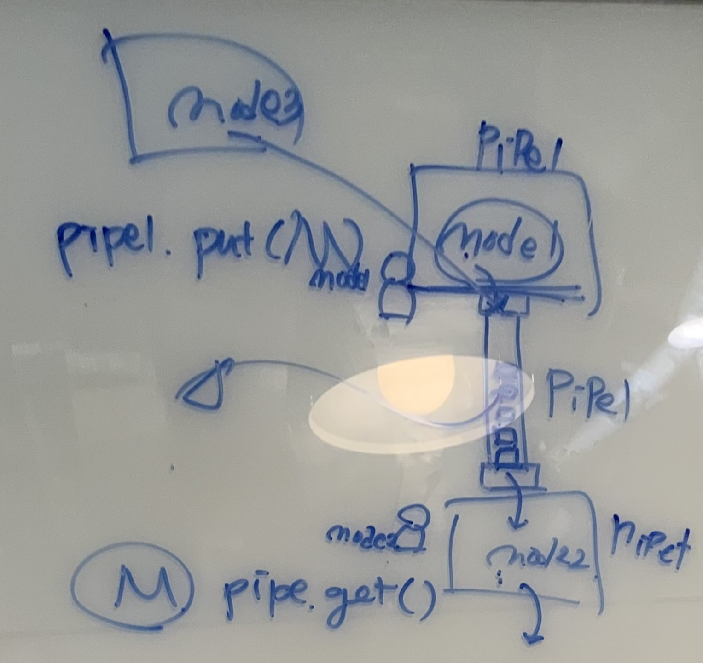
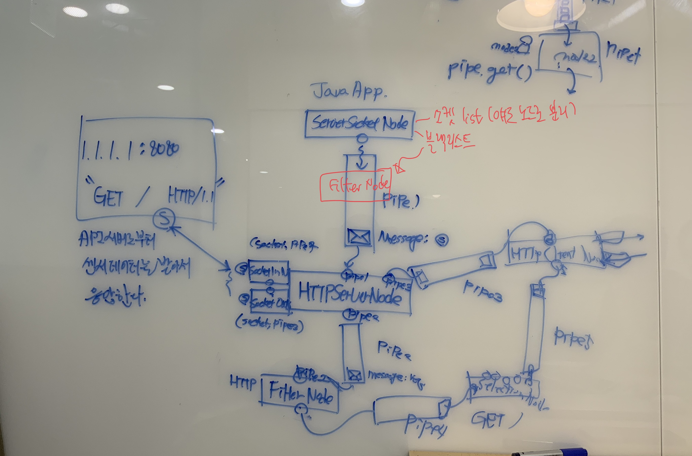
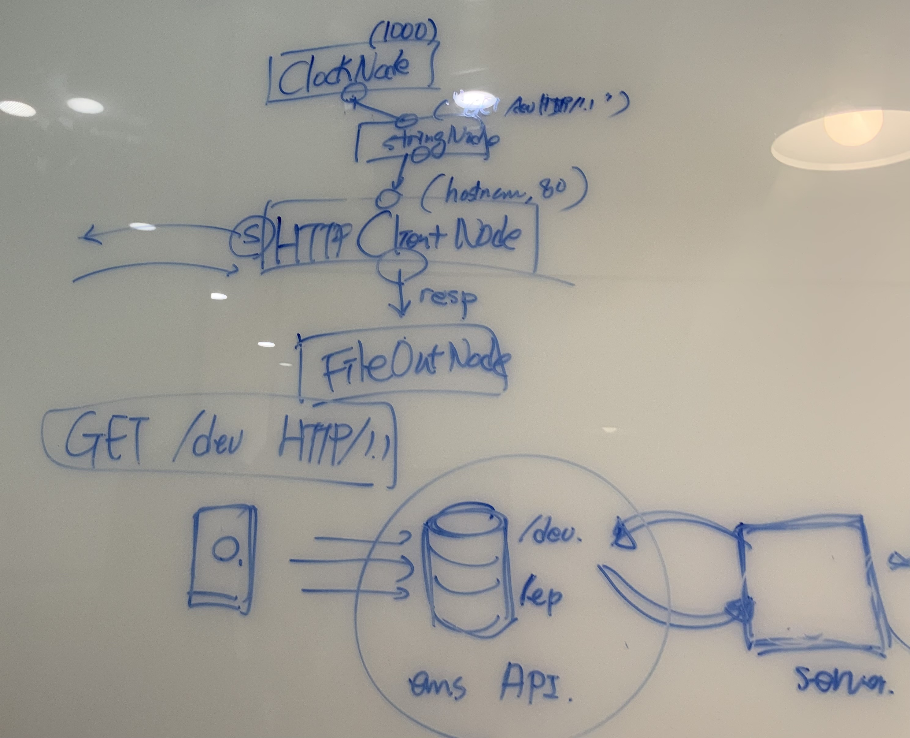
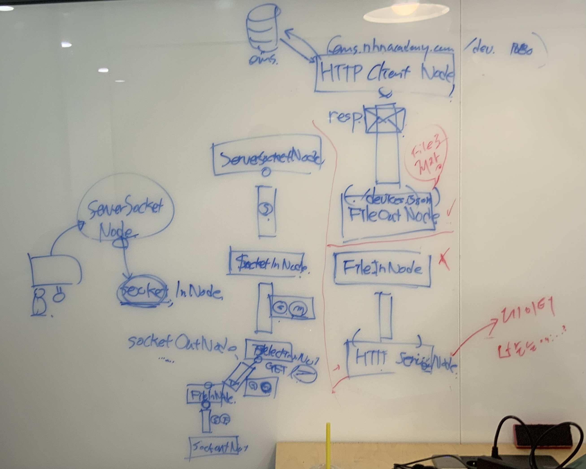

# 🛠️ XFLOW
NHN Academy XFlow 팀 프로젝트 저장소

FBP 기반의 웹 서비스

**팀 원 :** 남지민, 이정용, 이지현, 임찬휘

[노드 개발 가이드](https://github.com/jeongyongs/xflow/tree/sample)

## 1. 클래스 다이어그램

## 2. 노드 플로우

## 3. 개발 노트

|||
|---|---|
|||
|||
|||